# Awesome-Cloud-Cost-Analysis-Visualization 💰 📊

  

  
  
  
  
  
  

---

## 🌟 Top Cloud Cost Analysis & Visualization Ecosystem

**Curated List of Commercial FinOps Platforms & Open-Source Cost Visualization Tools**  
*Focused on Cost Dashboards, Anomaly Detection, Unit Economics, Kubernetes Cost Allocation & Self-Hosted Spend Analytics*

**Last updated: October 2026** 📅

---

### 📌 Overview & SEO Summary

Welcome to the ultimate curated directory of **cloud cost analysis and visualization platforms**, **open-source FinOps dashboards**, and **multi-cloud spend analytics frameworks**. Whether you are looking for enterprise-grade commercial solutions (such as *AWS Cost Explorer*, *CloudZero*, and *Vantage*), or self-hostable open-source alternatives (like *Infracost*, *OpenCost*, *Cloud Custodian*, and *Komiser*), this list covers category leaders, anomaly detection engines, and privacy-respecting cost governance.

---

## 📑 Table of Contents

- [🏢 SaaS & Commercial Platforms](#-saas--commercial-platforms)
- [🔓 Open-Source GitHub Projects](#-open-source-github-projects)
- [🛠️ How to Contribute](#%EF%B8%8F-how-to-contribute)
- [📊 Star History](#-star-history)
- [🤝 Support & Sponsorship](#-support--sponsorship)
- [⚠️ Disclaimer](#%EF%B8%8F-disclaimer)

---

## 🏢 SaaS / Commercial Platforms

> **Market Insights & Industry Overview**: The global Cloud Financial Management (FinOps) market is estimated to reach **$18.5 Billion by 2030** (CAGR ~18%). The market is **moderately fragmented** — native cloud hyperscalers (AWS, Azure, GCP) provide default entry-level cost visualization, while specialized FinOps vendors compete fiercely on unit economics, Kubernetes cost attribution, and automated commitment management without a single "winner-take-all" dominant player.

The cloud cost analysis and visualization market spans **free native cloud tools** (AWS Cost Explorer) that provide baseline dashboards at no cost, and **specialized FinOps platforms** that charge as a percentage of managed spend or per-resource fees. **AWS Cost Explorer** is **free for the API and console**, with **Savings Plans recommendations** at no additional cost, but **Cost Anomaly Detection charges $0.30 per monitored dimension per month**. **CloudZero** differentiates through **unit economics** — measuring cost per customer, per team, or per feature. **Finout** starts near **$6,000/year** and covers AWS, Azure, GCP, Kubernetes, Snowflake, and Datadog without requiring tagging cleanup first. **Vantage** offers a **free tier for 2 accounts and 10 cost reports**, with Pro at **$30/month + 3% of managed spend**. **Ternary** uses a **flat-rate pricing model based on cloud spend bands** with multi-year discounts up to **7.5%**. **Apptio Cloudability** allocates **100% of cloud costs including containers, support, and shared services**.

| SaaS / Commercial Platform | Company / Owner | Market Size / Company Valuation | Standard Edition Starting Price | Free Tier / Free Trial Limits | Description |
| :--- | :--- | :--- | :--- | :--- | :--- |
| **[AWS Cost Explorer](https://aws.amazon.com/aws-cost-management/aws-cost-explorer/)** ☁️ | Amazon | **~$2.0 Trillion** (Market Cap) | Free for console & API; $0.01 per Paginated API Request; $0.30/dimension/mo for Anomaly Detection | **Free forever** for AWS Management Console & basic API queries; 14-day history preview for cost anomaly detection | **AWS-native cost visualization** — Interactive charts for cost and usage. **Cost Anomaly Detection** uses ML to identify unusual spend patterns. **Savings Plans recommendations** included free. **The starting point for every AWS FinOps practice**. |
| **[Apptio Cloudability](https://www.apptio.com/products/cloudability/)** 💰 | IBM (Apptio) | **~$200.0 Billion** (IBM Market Cap) | $2,500/month for up to $1M managed spend (via AWS Marketplace) | **14-day free trial** with up to 3 cloud accounts connected; no permanent free tier | **Percentage-of-spend FinOps platform** — Overage fees: **$1,930 (Essentials) to $4,410 (Premium) per unit**. **Allocates 100% of cloud costs** including containers, support, and shared services. |
| **[Spot by NetApp (Flexera)](https://spot.io/)** 🟢 | NetApp / Flexera | **~$20.0 Billion** (NetApp Market Cap) | $1.415 per 100 vCPU hours (managed compute); savings-based pricing starting at 20% of net savings achieved | **20 vCPU VMs free forever**; 14-day free trial for enterprise features | **Cloud automation and optimization** — Continuous analytics for infrastructure optimization. Savings-based billing aligns fees with achieved value. **Costs scale with savings achieved**. |
| **[Harness CCM](https://www.harness.io/)** 🚀 | Harness | **~$3.7 Billion** (Valuation) | $250/month starter plan or 2.5% of cloud spend under management | **Free forever** for teams with <$250K/year cloud spend (up to 2 K8s clusters, 30-day data retention) | **Modular FinOps platform** — **Commitment Orchestrator** for Savings Plans optimization. **AutoStopping** automatically stops idle resources (up to 75% savings). **Cluster Orchestrator** for Kubernetes. |
| **[CloudZero](https://www.cloudzero.com/)** 📊 | CloudZero | **~$500.0 Million** (Valuation) | $15,000/year minimum platform tier for cloud spend under $1M/year | **14-day free trial** with sample cloud infrastructure telemetry; no perpetual free plan | **Unit economics cloud cost platform** — Answers "What does it cost to serve this customer?" **Allocation by customer, team, product, or feature**. Engineering-led approach to cost accountability. |
| **[Finout](https://www.finout.io/)** 🎯 | Finout | **~$300.0 Million** (Valuation) | $6,000/year starting price tier for multi-cloud & Snowflake billing ingestion | **14-day free trial** with access to MegaBill ingestion dashboard | **MegaBill cost management** — Covers AWS, Azure, GCP, Kubernetes, Snowflake, and Datadog **without tagging prerequisites**. **Billy AI agent** investigates, decides, and acts across the estate. |
| **[Anodot](https://www.anodot.com/)** 📈 | Anodot | **~$250.0 Million** (Valuation) | $40,000/year starting contract for multi-cloud MSP / enterprise spend | **14-day free trial** with automated cloud anomaly detection monitoring | **Cloud cost management for MSPs** — **Cloud unit economics** measurement for profit margin optimization. Commitment portfolio management with automated RI/SP purchasing recommendations. Multi-year discounts: **15–30%**. |
| **[Kubecost Enterprise](https://www.kubecost.com/)** 💰 | IBM (Kubecost) | **~$150.0 Million** (Acquired by IBM) | $75/cluster/month (Enterprise tier) with multi-cluster aggregation | **Free forever** for single cluster (up to 250 cores or $100K spend cap over 30 days) | **Kubernetes cost monitoring and optimization** — Real-time cost allocation, savings recommendations, and multi-cluster visibility. **EKS-optimized bundle is free with no spend cap**. |
| **[Vantage](https://www.vantage.sh/)** 💰 | Vantage | **~$100.0 Million** (Valuation) | $30/month + 3% of managed spend for Pro tier | **Free forever** for 2 cloud accounts, 10 cost reports, and 5 saved dashboards | **Cloud cost transparency platform** — Multi-cloud cost visibility with **savings opportunities** via Compute Optimizer, Rightsizing, and Reserved Instance recommendations. Free tier is generous for small teams. |
| **[Ternary](https://ternary.app/)** 🔺 | Ternary | **~$50.0 Million** (Valuation) | $1,200/month flat-rate based on spend bands (no percentage penalty) | **14-day free trial** with full multi-cloud FinOps feature access | **Multi-cloud FinOps platform** — Flat-rate pricing with multi-year discounts up to **7.5%**. **Commitment management** across AWS, Azure, and GCP. **The most transparent enterprise pricing model**. |

---

## 🔓 Open-Source GitHub Projects

*Sorted by GitHub_Stars_Count (Descending)* 🌟

- **[Infracost](https://github.com/infracost/infracost)**  ⚡  
  **Cloud cost estimates for Terraform in pull requests**, Apache-2.0 licensed. **Shift-left FinOps** — shows cost impact of infrastructure changes before deployment. Supports AWS, Azure, GCP, and **1,000+ resources**. CLI, GitHub Actions, GitLab CI, and VS Code extension. **The standard for preventing cost regressions in CI/CD**. 💰

- **[Steampipe](https://github.com/turbot/steampipe)**  🔎  
  **Query cloud APIs with SQL**, AGPL-3.0 licensed. **Zero-ETL approach** — query AWS, Azure, GCP, Kubernetes, and 100+ services directly. **Build custom cost reports with SQL**. The simplest way to explore cloud billing and configuration data without data pipelines. 🔗

- **[Cloud Custodian](https://github.com/cloud-custodian/cloud-custodian)**  🛡️  
  **Rules engine for cloud security, cost optimization, and governance**, Apache-2.0 licensed. **YAML-based policies for AWS, Azure, GCP** — no code required for common use cases. **Automated remediation**: tag enforcement (critical for cost allocation), idle resource cleanup, rightsizing, and compliance. **The most mature open-source cloud governance engine**. 🛡️

- **[CloudQuery](https://github.com/cloudquery/cloudquery)**  📦  
  **Cloud asset inventory and CSPM**, MPL-2.0 licensed. **Extracts cloud configuration into PostgreSQL** for querying and analysis. **Enables custom FinOps queries** across multi-cloud environments. The foundation for building custom cost governance dashboards. 📦

- **[Komiser](https://github.com/tailwarden/komiser)**  🔍  
  **Cloud resource visibility and cost optimization**, Apache-2.0 licensed. **Multi-cloud dashboard for AWS, Azure, GCP, DigitalOcean, OCI, and Kubernetes**. **Detects idle resources, orphaned volumes, and untagged assets**. **Self-hosted or Komiser Cloud**. **Visual interface shows all cloud resources in one place** — the fastest way to answer "what am I paying for?" and "what's not tagged?". 🔍

- **[OpenCost](https://github.com/opencost/opencost)**  🌱  
  **Open-source cost monitoring for Kubernetes**, Apache-2.0 licensed. **Originally developed and open-sourced by Kubecost**. **Real-time cost allocation** by cluster, node, namespace, controller, service, or pod. **Multi-cloud monitoring for AWS, Azure, GCP** with dynamic on-demand pricing from cloud billing APIs. **MCP server built into Helm chart** (opt-in, port 8081) for AI agent access to cost queries. 🌱

- **[Kubecost Free](https://github.com/kubecost/cost-analyzer-helm-chart)**  📊  
  **Kubernetes cost monitoring and optimization**, Apache-2.0 licensed. **Free tier: unlimited clusters, 250 cores or $100K spend cap over 30 days**. **EKS-optimized bundle is free with no spend cap** and integrates with AWS billing for accurate Savings Plans and RI reconciliation. **ETL feature** aggregates metrics for namespace-level, pod-level, and deployment-level visibility. 💰

- **[Cloud Carbon Footprint](https://github.com/cloud-carbon-footprint/cloud-carbon-footprint)**  🌍  
  **Estimate and visualize cloud carbon emissions**, Apache-2.0 licensed. **Green FinOps** — correlates cloud spend with carbon impact. Supports AWS, Azure, GCP. **The leading open-source tool for cloud sustainability**. 🌍

- **[Yotascale FinOps Tools](https://github.com/yotascale/yotascale-tools)**  🔧  
  **Open-source scripts and tools for multi-cloud cost allocation**, Apache-2.0 licensed. Utilities for container cost management, tag enforcement, and cost reporting automation across AWS and Azure environments. 🛠️

- **[AWS Cost Explorer CLI](https://github.com/aws/aws-cost-explorer-cli)**  🖥️  
  **CLI for AWS Cost Explorer**, Apache-2.0 licensed. **Query cost and usage data from terminal**. Export reports, filter by service/region/tag, and integrate with scripts. **Lightweight alternative to AWS Console** for FinOps engineers. 🖥️

- **[Azure Cost CLI](https://github.com/mivano/azure-cost-cli)**  🔵  
  **CLI for Azure Cost Management**, MIT licensed. **Query Azure costs from terminal**. Daily/monthly cost breakdowns, service-level analysis, and budget tracking. **Simple, scriptable Azure FinOps**. 🔵

- **[Focus CLI](https://github.com/finopsfoundation/focus-cli)**  📐  
  **Reference CLI for FOCUS specification**, open-source. **FOCUS (FinOps Open Cost and Usage Specification)** — provides a common schema for cloud billing data across AWS, Azure, and GCP. **Normalizes cost data** for multi-cloud analysis. **The emerging standard for FinOps data interoperability**. 📐

---

## 🛠️ How to Contribute

Contributions are welcome! Follow these steps to submit new cloud cost analysis platforms or open-source visualization software:

1. 🍴 **Fork** the repository.
2. 📝 **Add/edit** entries in `README.md` maintaining table/list structure and formatting.
3. 🔗 Include project title, official website/GitHub link, exact Stars_Count, license, and brief description.
4. 🚀 Submit a **Pull Request** with a descriptive summary of your changes.

---

## 📊 Star History

---

## 🤝 Support & Sponsorship

Thank you for exploring and using **Awesome-Cloud-Cost-Analysis-Visualization**! 💖 If you find this curated collection useful for your FinOps workflows, cloud cost dashboards, or cost optimization research, please consider supporting the project:

- ⭐ **Star** this repository to increase visibility and help others discover it!
- 🔀 **Fork** and share with fellow FinOps engineers, DevOps teams, finance teams, and open-source advocates.
- ☕ **Sponsor & Buy Me a Coffee**: Support ongoing open-source curation via the [GitHub Sponsor Dashboard](https://github.com/sponsors/ishandutta2007).

---

## ⚠️ Disclaimer

- This is a **community-curated** list — not exhaustive and not an endorsement. ℹ️
- **AWS Cost Explorer console and API are free** — **Cost Anomaly Detection charges $0.30 per monitored dimension per month**. A "dimension" is a unique combination of account, service, and region — a large organization can easily have hundreds of dimensions, adding hundreds of dollars monthly.
- **Apptio Cloudability overage fees** range from **$1,930 (Essentials) to $4,410 (Premium) per unit** — a 20% spend growth mid-year can add tens of thousands in unplanned fees. **Percentage-of-spend pricing couples your tooling cost to your cloud bill**.
- **CloudZero and Finout pricing is quote-based** — no public per-unit price. **Finout starts near $6,000/year** but covers multiple data sources without tagging prerequisites.
- **Ternary uses flat-rate pricing based on spend bands** — the most transparent enterprise model, with multi-year discounts up to **7.5%**. No percentage-of-spend escalation.
- **Harness CCM Free Forever** limits cloud spend to **$250K/year** with **2 Kubernetes clusters** and **30-day data visibility**.
- **Kubecost Free** supports **250 cores or $100K spend over 30 days** with **no unified multi-cluster view** — the EKS-optimized bundle removes the spend cap but still lacks unified visibility.
- Open-source solutions (Komiser, OpenCost, Kubecost, Infracost) provide self-hosted ownership and transparency, but enterprise-grade SLA guarantees, multi-cloud cost allocation at scale, and vendor support remain primarily commercial offerings. **Always validate cost data against native cloud billing consoles** before making financial decisions. 💰

---

  <b>Made with ❤️ for FinOps engineers, finance teams, and open-source cost visualization advocates.</b>

